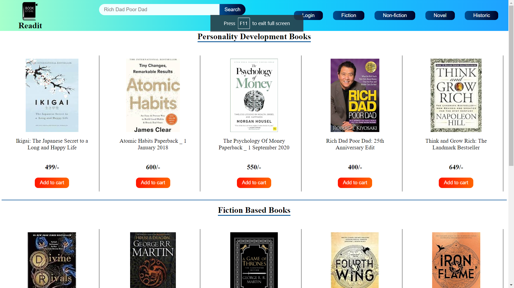
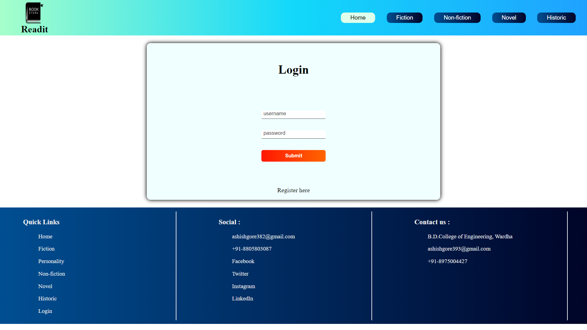
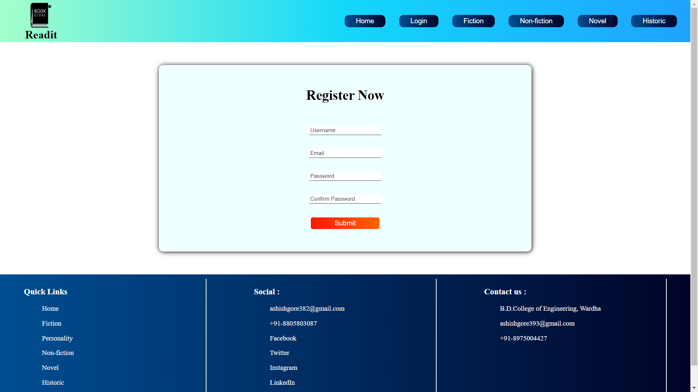
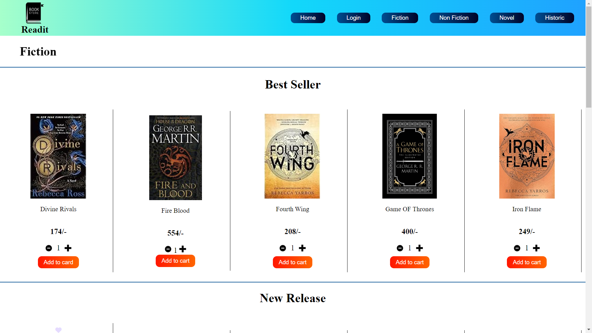
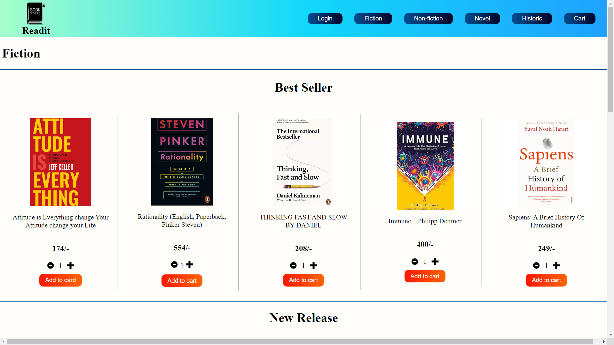
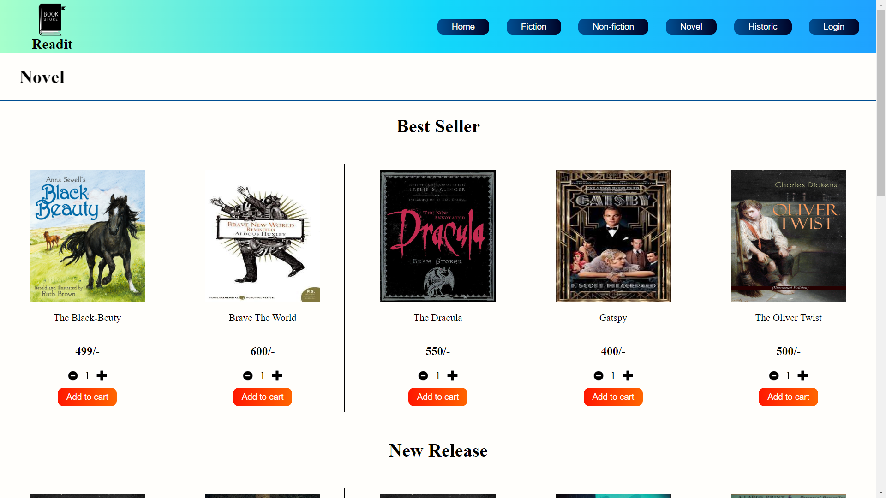
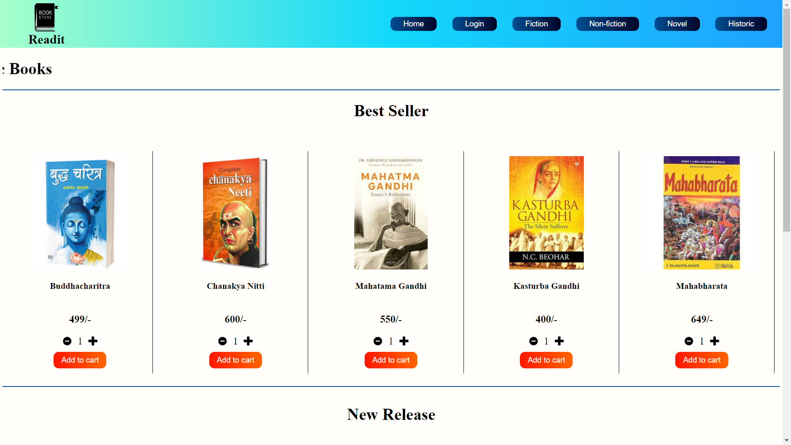
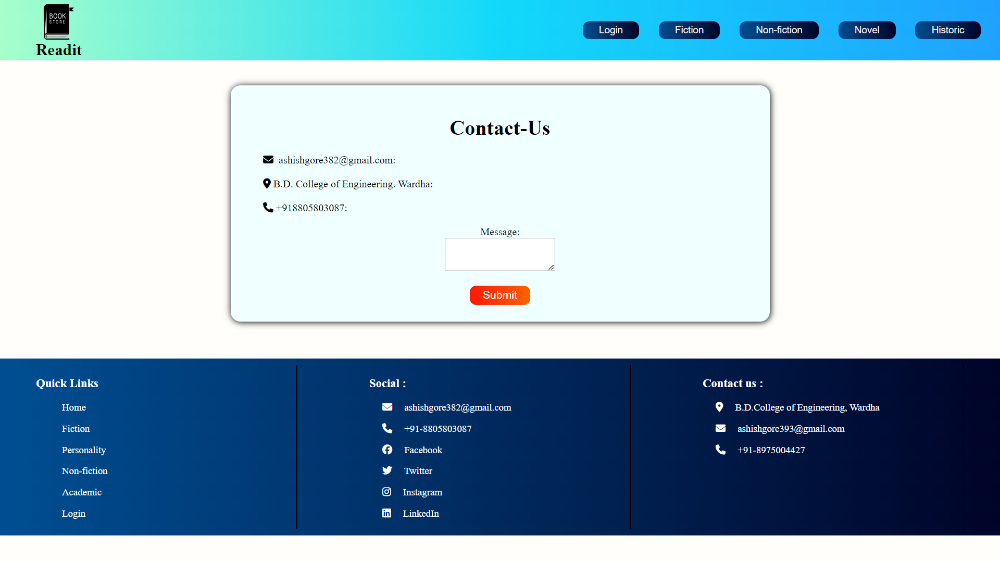

# Readit
## icp-6-group-10-html-css-javascript-project-2

### What is Readit?
Readit is a group project created by the members of Project Group 10 of Internship Cohort Program 6.0 by Road to Code.

## The following are images from the website:

### The Home Page

### The Login section

### The Register section

### The Fiction section

### The Non-Fiction section

### The Novel section

### The Historic dection

### The Contact section

### Description 
The project is made using the basics of **HTML**  and **CSS** and **JavaScript**.
The website is the frontend implementation of a online shopping store.

### Description of work :

Every member created a page in the project

1. Home Page - Ashish Gore
2. Login - Rushali Devtarse
3. Register - Ashwini Malwade
4. Fiction - Ratandeep Bulbake
5. Non-fiction - Divya Kasule
6. Novel - Chetana Bahale
7. Historic - Harshvardhan Patle
8. Contact - Prachi Gawali

### Use of project
It is an implementation of ecommerece website that can be used to buy books online.

